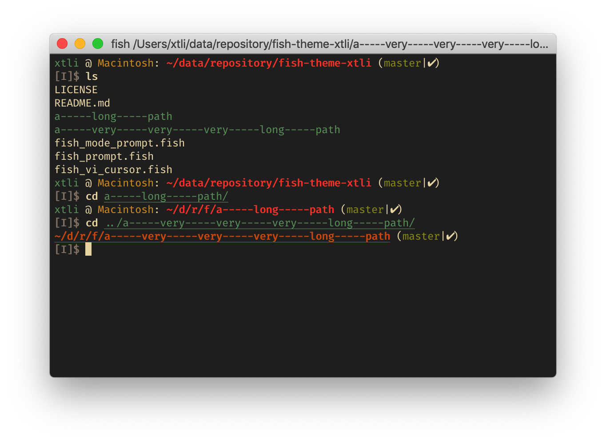

# fish-theme-xtli

A minimal theme forked from the oh-my-fish/theme-cbjohnson theme via znculee/fish-theme-xtli.

**Install** with [fisher](https://github.com/jorgebucaran/fisher) using command `fisher add mlegner/fish-theme-xtli`.

## Features

- Automatically changing mode according to the terminal width.
- Display git information.
- Display conda information.
- Display username, hostname and current path.
- Fast, clear, simple and extensible.
- Comfort with solarized dark.

## Troubleshooting

### prompt_pwd always shows abbreviated version

If the `prompt_pwd` shows abbreviated version even with enough space, you may add `set fish_prompt_pwd_dir_length 0` in your `~/.config/fish/config.fish`.

### multi-line prompt repaints in iterm

Save an empty `fish_vi_cursor` function solves this problem.
